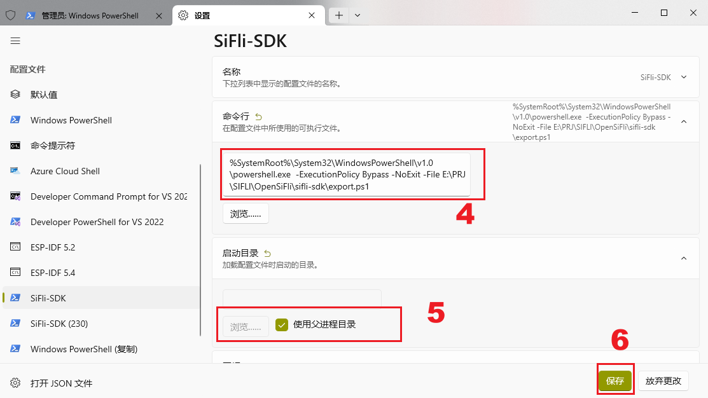
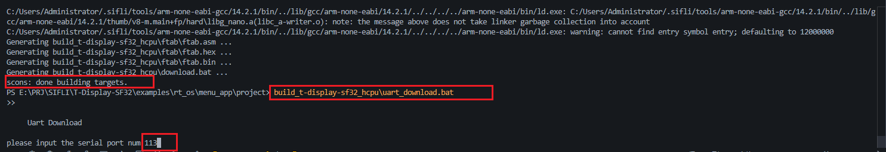

# T-Display-SF32 SDK

## 📝 Project Overview
This project is the official SDK for **T-Display-SF32**, developed based on `SiFli SDK (2.4.0)`, aiming to help developers quickly get started and develop applications for T-Display-SF32.

**Core Directory Description:**
- `sifli-sdk/customer/boards`: Board-level configuration files
- `sifli-sdk/examples`: Official peripheral driver examples
- `sifli-sdk/t_sf32_display_hw_device`: T-Display-SF32 exclusive hardware drivers
- `sifli-sdk/middleware`: Official middleware
- `sifli-sdk/external`: Official third-party libraries

📚 **Supporting Documentation:**
- [SiFli Wiki](https://wiki.sifli.com/)
- [SiFli SDK Official Documentation](https://docs.sifli.com/projects/sdk/latest/sf32lb52x/index.html)

---

## ✅ Prerequisites
Before starting development, ensure your development environment meets the following requirements:

1. **Python**: Version `3.9 - 3.14`. When installing, make sure to check the option to add Python to the system environment variables (PATH).
2. **Terminal Tool**: SiFli-SDK scripts currently only support PowerShell. It is recommended to install and use **PowerShell 7**.

---

## 🛠️ Environment Setup and Configuration

### 1. Obtain the SDK
Download this SDK and extract it to any directory, for example: `D:\T-Display-SF32\SDK`.

### 2. Configure the PowerShell Terminal Environment
1. Open Windows Terminal and press `Ctrl + ','` to open settings.
2. Click "Add a new profile" and select "Duplicate Windows PowerShell."
3. Modify the settings of the new profile:
   - **Name**: Change to `SiFli-SDK`
   - **Starting Directory**: Select "Use parent process directory"
   - **Command Line**: Modify to the following format (make sure to replace the path to `export.ps1` with the actual path where you extracted the SDK):
     ```powershell
     %SystemRoot%\System32\WindowsPowerShell\v1.0\powershell.exe -ExecutionPolicy Bypass -NoExit -File D:\T-Display-SF32\SDK\sifli-sdk\export.ps1
     ```


---

## 🚀 Build and Flash

Use the [SiFli-SDK](http://_vscodecontentref_/0) terminal configured in the previous step to perform the following operations:

### 1. Enter the Project Directory
```powershell
cd sifli-sdk\example\rt_driver\project
```

### 2. Build the Project
Use the following command to build the project (-j16 indicates using 16 threads to accelerate the build, adjust based on your computer's configuration):
```powershell
scons --board=t-display-sf32_hcpu -j16
```


### 3. Flash the Firmware
After the build is complete, execute the following batch file to enter flashing mode, then follow the prompts to input the device's port number to complete the flashing:
```powershell
build_t-display-sf32_hcpu\uart_download.bat
```


### 4. Menu Configuration (Optional)
If you need to modify the project configuration, you can run the following command to open the menuconfig interface:
```powershell
scons --board=t-display-sf32 --menuconfig
```

📜 License Information
This project follows the corresponding open-source license. For specific information, please refer to the SDK source code and the LICENSE file in the sifli-sdk directory. Development using the SiFli SDK must comply with SiFli's official licensing agreements.

💡 Additional Information
Common Issues: If you encounter Python-related errors, first check whether the Python version and environment variables are configured correctly. If you encounter build errors, check whether the terminal is the dedicated PowerShell with export.ps1 loaded.
Technical Support: For more information on low-level drivers and peripheral usage, refer to the official example code in the examples folder and the official documentation.
