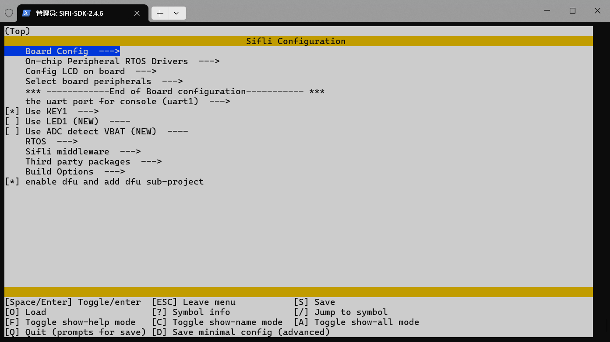
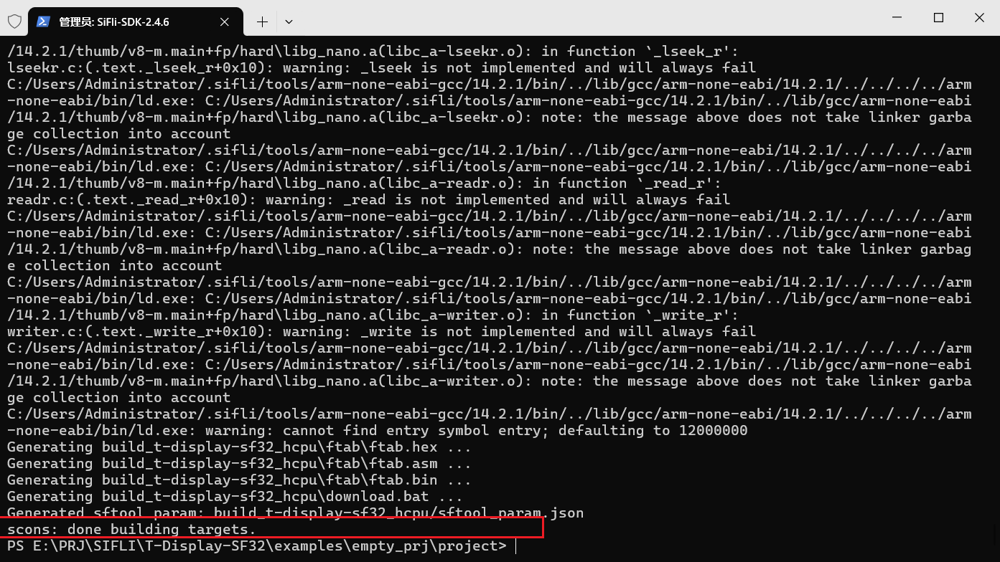
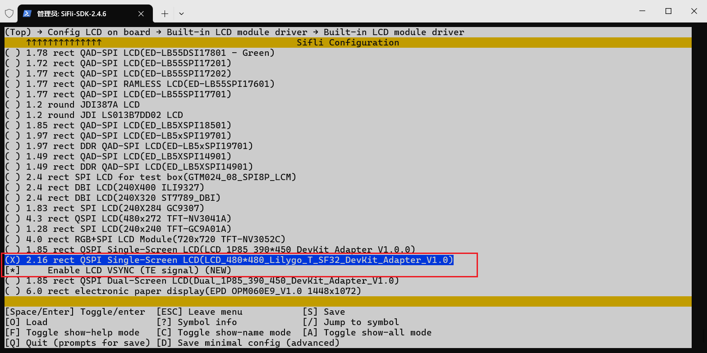
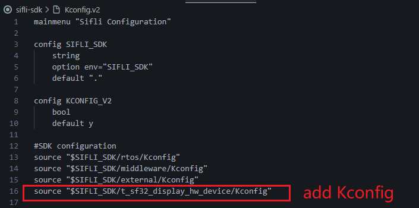
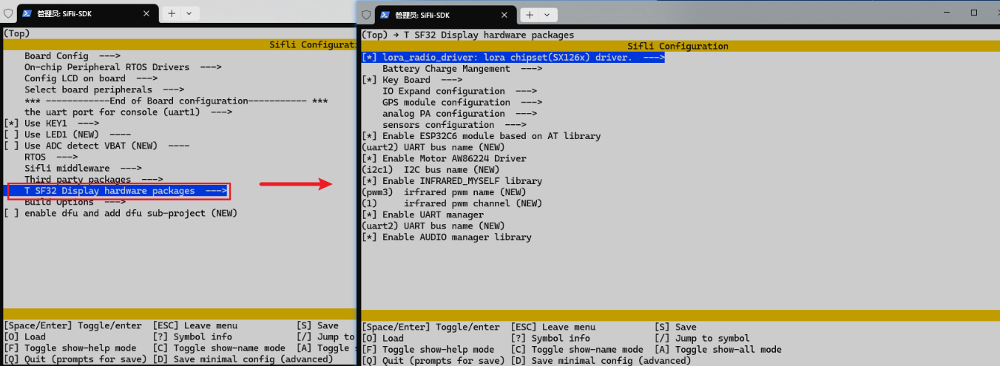

# LILYGO-T-SF32 SDK 更新安装

## 1. 下载SDK
下载最新的SDK，解压到任意目录，例如：`D:\SiFli-SDK`,根据官方文档[SDK_Install](https://docs.sifli.com/projects/sdk/latest/sf32lb52x/quickstart/install/script/windows.html)安装好SDK编译环境。

## 2. Windows Terminal 快捷配置
查看[readme.md](./readme_CN.md#2-配置-powershell-终端环境)文件，找到`Windows Terminal`的快捷配置,进行命令行的配置。

## 3.移植LILYGO-T-SF32相关硬件驱动库
### a. 移植板卡文件
将旧版本SDK文件的`customer\boards\t-display-sf32`和`customer\boards\t-display-sf32-base`文件夹复制到新SDK文件的`customer\boards`目录下。

修改新SDK文件`customer\boards\Kconfig_lcd`文件。
#### (1) 找到`BSP_USING_BUILTIN_LCD`的`choice`片段，在if语句里面添加以下内容：
```
    choice
        prompt "Built-in LCD module driver"
        default LCD_USING_ED_LB55DSI17801
    ......
        config LCD_USING_TFT_CO5300_T_SF32
                 bool "2.16 rect QSPI Single-Screen LCD(LCD_480*480_Lilygo_T_SF32_DevKit_Adapter_V1.0)"
                 select LCD_USING_CO5300
                 select TSC_USING_CST922 if BSP_USING_TOUCHD
                 select BSP_LCDC_USING_QADSPI
                 if LCD_USING_TFT_CO5300_T_SF32
                    config LCD_CO5300_VSYNC_ENABLE
                         bool "Enable LCD VSYNC (TE signal)"
                         def_bool y
                 endif
    endchoice

```

#### (2) 找到`BSP_USING_BUILTIN_LCD`的`LCD_HOR_RES_MAX`和`LCD_VER_RES_MAX`和`LCD_DPI`片段，添加以下内容：
```
config LCD_HOR_RES_MAX
        int
        ......
        default 480 if LCD_USING_TFT_CO5300_T_SF32

config LCD_VER_RES_MAX
        int
        ......
        default 480 if LCD_USING_TFT_CO5300_T_SF32

config LCD_DPI
        int
        ......
        default 480 if LCD_USING_TFT_CO5300_T_SF32

```
#### (3) 验证是否移植成功
打开`Windows Terminal`进入SDK终端,进入`T-Display-SF32\examples\empty_prj\project`文件夹，执行以下命令：
```
scons --board=t-display-sf32 --menuconfig  
scons --board=t-display-sf32_hcpu -j8  
```
如果出现menuconfig界面和编译通过，则表示移植成功。



### b. 移植触摸屏驱动库
将旧版本SDK文件的触摸驱动`customer\peripherals\cst922`复制到新SDK文件的`customer\peripherals`目录下。屏幕驱动使用`LCD_USING_CO5300`

修改新SDK文件`customer\peripherals\Kconfig`文件。
#### (1) 找到`BSP_USING_TOUCHD`片段，添加以下内容：
```
# TP driver of LCD module 
......

config TSC_USING_CST922
    bool
    default n
```

#### (2) 验证是否移植成功
打开`Windows Terminal`进入SDK终端,进入`T-Display-SF32\examples\lcd\project`文件夹，执行以下命令：
```
scons --board=t-display-sf32 --menuconfig 
```
进入menuconfig界面，选择`Config LCD on board -> Enable LCD on the board`，选择


按下`D`保存退出，执行以下编译命令和烧录命令：
```
scons --board=t-display-sf32_hcpu -j8  
build_t-display-sf32_hcpu\uart_download.bat
```
屏幕点亮，串口出现触摸坐标信息，代表移植成功。

### c. T-SF32-Display外设驱动库
将旧版本SDK文件的`sifli-sdk\t_sf32_display_hw_device`复制到新SDK文件的`sifli-sdk`目录下。
修改新SDK文件`sifli-sdk\Kconfig.v2`文件。
```
# Add third party packages
#SDK configuration	
source "$SIFLI_SDK/t_sf32_display_hw_device/Kconfig"
```


打开`Windows Terminal`进入SDK终端,进入`T-Display-SF32\examples\empty_prj\project`文件夹，执行以下命令：
```
scons --board=t-display-sf32 --menuconfig  
```
进入menuconfig界面,`T SF32 Display hardware packages --->`出现刚刚添加的硬件驱动选择项，则证明移植成功。
